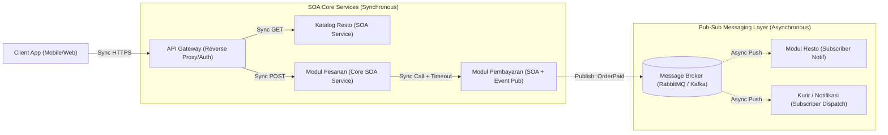

# Tugas 2 - Perancangan Arsitektur
## 1. Pemilihan Gaya Arsitektur

Pada sistem FoodGo, kami memilih **kombinasi Service-Oriented Architecture (SOA) dan Publish-Subscribe (Pub-Sub)**. SOA digunakan untuk memisahkan sistem menjadi beberapa service berdasarkan fungsi, seperti modul pesanan (Order Service), modul pembayaran (Payment Service), modul katalog restoran, serta modul kurir dan notifikasi. Sementara itu, Pub-Sub digunakan untuk komunikasi asynchronous pada proses yang tidak harus menunggu respons secara langsung.

Pemilihan kombinasi ini didasarkan pada masalah pada sistem FoodGo sebelumnya yang masih berbentuk monolitik. Semua modul berjalan dalam satu aplikasi sehingga ketika salah satu bagian mengalami beban tinggi atau gangguan, bagian lain dapat ikut terdampak. Pada Tugas 1, masalah tersebut berkaitan dengan Single Point of Failure, tidak adanya isolasi sumber daya, serta kemungkinan terjadinya cascading failure.

Dengan SOA, setiap modul dapat dikembangkan dan dijalankan secara lebih mandiri sehingga ketergantungan antar-modul dapat dikurangi. Kemudian, Pub-Sub digunakan untuk proses asynchronous, misalnya setelah pembayaran berhasil, event dapat dikirim melalui Message Broker dan diterima oleh modul notifikasi restoran serta modul kurir secara independen. Hal ini membuat komunikasi antar-service menjadi lebih loosely coupled.

Kombinasi ini juga memiliki trade-off, yaitu sistem menjadi lebih kompleks karena membutuhkan beberapa service dan Message Broker. Selain itu, proses debugging menjadi lebih sulit karena alur asynchronous tidak selalu berjalan secara linear. Namun, pendekatan ini sesuai dengan permasalahan FoodGo karena dapat membantu mengurangi ketergantungan antar-modul dan membatasi dampak kegagalan satu bagian terhadap sistem secara keseluruhan.

## 2. diagram
## Skenario 1: Diagram SOA + Pub-Sub

## 3. Alur Skenario

Alur dimulai ketika pelanggan mengirim request melalui **Client App** ke **API Gateway** menggunakan HTTPS. Gateway kemudian meneruskan request ke **Modul Katalog Resto** untuk mengambil informasi menu secara **sinkron dengan pola request-response**, lalu hasilnya dikembalikan ke pelanggan.

Setelah pelanggan memilih menu dan membuat pesanan, request diteruskan oleh Gateway ke **Modul Pesanan (Order Service)**. Modul Pesanan kemudian berkomunikasi dengan **Modul Pembayaran (Payment Service)** untuk memproses atau memverifikasi pembayaran secara **sinkron dengan pola request-response**.

Setelah pembayaran berhasil, **Payment Service** mengirimkan **event `OrderPaid`** ke **Message Broker** seperti RabbitMQ atau Kafka secara **asynchronous**. Broker kemudian meneruskan event tersebut kepada subscriber, yaitu **Modul Notifikasi Resto** dan **Modul Notifikasi & Penugasan Kurir**. Kedua modul tersebut memproses event secara **asynchronous** untuk memberikan notifikasi kepada restoran dan melakukan proses penugasan atau notifikasi kurir.

## 4. analisis

Arsitektur SOA dan Publish-subscribe dapat mengatasi masalah coupling pada foodgo karena setiap fungsi utama dipisahkan menjadi service yang memiliki tanggung jawab masing-masing. Modul pesanan, pembayaran, katalog resto, serta kurir/notifikasi tidak lagi bergantung pada satu aplikasi monolitik. Dengan pemisahan tersebut, perubahan atau deployment pada satu service tidak harus menyebabkan seluruh sistem ikut dihentikan atau direstart. Hal ini juga membantu mengurangi dampak Single Point of Failure dan cascading failure, karena gangguan pada satu service tidak secara langsung menghentikan service lainnya.
Penggunaan Pub-Sub semakin mengurangi ketergantungan antar service, terutama untuk proses yang tidak harus mendapatkan respons secara langsung. Contohnya, setelah pembayaran berhasil payment service cukup mengirimkan event OrderPaid ke message Broker. Modul notifikasi resto dan modul kurir kemudian dapat menerima dan memproses event tersebut secara independen. Dengan demikian modul payment service tidak perlu menunggu kedua modul tersebut selesai bekerja. Hal ini membuat sistem lebih loosely coupled atau ketergantungan antar service lebih rendah dan memungkinkan proses berjalan secara asynchronous. 
Namun, penggunaan SOA dan Pub-Sub juga memiliki beberapa trade off yaitu sistem menjadi lebih kompleks karena membutuhkan beberapa service, message broker, serta mekanisme tambahan untuk memantau komunikasi antar service. Selain itu debugging menjadi lebih sulit karena alur asynchronous tidak selalu berjalan secara linear atau berurutan seperti aplikasi monolitik. Pesan juga dapat mengalami keterlambatan atau kegagalan sehingga sistem perlu menangani retry, duplicate event, dan kemungkinan eventual consistency atau tidak langsung sama di semua service. Dengan demikian meskipun SOA dan Pub-Sub dapat meningkatkan fleksibilitas dan isolasi kegagalan, penerapan nya membutuhkan pengelolaan sistem yang lebih kompleks dibandingkan arsitektur monolitik.
