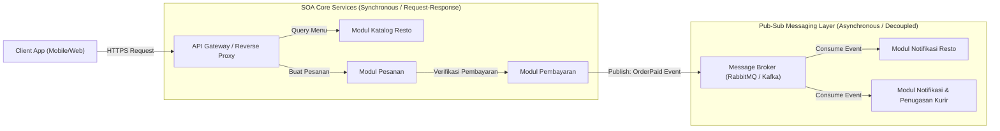

````markdown

````

````markdown
```mermaid
graph LR
    Client["Client App (Mobile/Web)"] -->|Sync HTTPS| GW["API Gateway (Reverse Proxy/Auth)"]
    
    subgraph SOA_Core ["SOA Core Services (Synchronous)"]
        GW -->|Sync GET| RestoCatalog["Katalog Resto (SOA Service)"]
        GW -->|Sync POST| OrderService["Modul Pesanan (Core SOA Service)"]
        OrderService -->|Sync Call + Timeout| PaymentService["Modul Pembayaran (SOA + Event Pub)"]
    end
    
    subgraph Event_Brokering ["Pub-Sub Messaging Layer (Asynchronous)"]
        Broker[("Message Broker (RabbitMQ / Kafka)")]
        RestoNotif["Modul Resto (Subscriber Notif)"]
        CourierService["Kurir / Notifikasi (Subscriber Dispatch)"]
    end

    PaymentService -.->|Publish: OrderPaid| Broker
    Broker -.->|Async Push| RestoNotif
    Broker -.->|Async Push| CourierService
````
